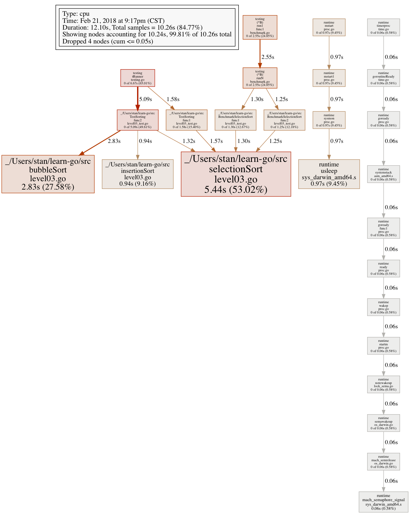
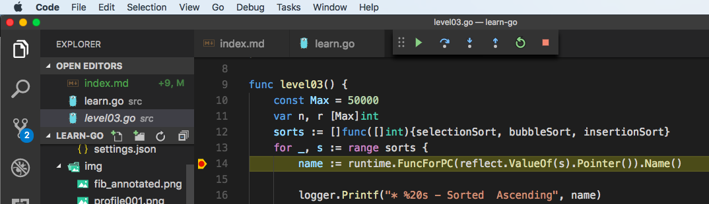

# Learn Go

I am learning the Go language by building over simple examples **(Work In Progress)**

---

## Table of Contents

---

### SETUP
[Installing go on macOS](#installing-go-on-macos)


### LEVEL 1

Source Code [/src/level01.go](/src/level01.go)\
[Find Environment Variables](#find-environment-variables)\
[Get the variables separately using range](#get-the-variables-separately-using-range)\
[Get both index and values variables separately](#get-both-index-and-values-variables-separately)\
[Ignore index using underscore](#ignore-index-using-underscore)\
[Split the values](#split-the-values)\
[Get only the environment variable names](#get-only-the-environment-variable-names)\
[Call a function](#call-a-function)\
[Concurrency](#concurrency)\
[Have the routines finish before main](#have-the-routines-finish-before-main)\
[Parallel run on multiple CPUs](#parallel-run-on-multiple-cpus)

### LEVEL 2

Source Code [/src/level02.go](/src/level02.go)\
[Fibonacci Using Recursion](#fibonacci-using-recursion)\
[Fibonacci Using Iteration](#fibonacci-using-iteration)\
[Passing a function as an argument](#passing-a-function-as-an-argument)\
[Anonymous Functions](#anonymous-functions)\
[4 times in a row: Fibonacci Using Iteration](#4-times-in-a-row-fibonacci-using-iteration)\
[4 times in a row: Fibonacci Using Iteration And Concurrency](#4-times-in-a-row-fibonacci-using-iteration-and-concurrency)\
[4 times in a row: Fibonacci Using Iteration And Concurrency With Multiple CPUs](#4-times-in-a-row-fibonacci-using-iteration-and-concurrency-with-multiple-cpus)

### LEVEL 3

Source Code [/src/level03.go](/src/level03.go)\
[Sorting Setup](#sorting-setup)\
[Selection Sort](#selection-sort)\
[Bubble Sort](#bubble-sort)\
[Insertion Sort](#insertion-sort)\
[Passing an array of functions as parameter](#passing-an-array-of-functions-as-parameter)\
[Reflection](#reflection)\
[Logging](#logging)

### LEVEL 4

Source Code [/src/level03_test.go](/src/level03_test.go)\
[Unit Testing](#unit-testing)\
[Benchmarks](#benchmarks)\
[Trace](#trace)\
[CPU Profile](#cpu-profile)\
[Flame Graph](#flame-graph)\
[Memory Profile](#memory-profile)\
[Debug an infinite loop](#debug-an-infinite-loop)\
[Debug using Delve](#debug-using-delve)\
[Debug in Visual Studio Code](#debug-in-visual-studio-code)

### LEVEL 5

Source Code [/src/level05.go](/src/level05.go)\
[Error Variable](#error-variable)\
[Error Type](#error-type)\
[Execute OS Commands](#execute-os-commands)\
[Read a File](#read-a-file)\
[Sort the prefixes](#sort-the-prefixes)\
[Find mean and median](#find-mean-and-median)\
[Text Templates](#text-templates)

[//]: # (7 common mistakes in Go and when to avoid them by Steve Francia Docker)

[//]: # (https://www.youtube.com/watch?v=29LLRKIL_TI)

---

## SETUP

### Installing go on macOS

```bash
brew update
brew upgrade
brew install go --cross-compile-common
```

To run the examples here:

```bash
git clone https://github.com/stangeorge/learn-go.git
go run learn-go/src/*.go
```

Change prompt to just $ using: `export PS1="$ "`

---

## LEVEL 1: [/src/level01.go](/src/level01.go)

---

### Find Environment Variables

**Concepts:** package, imports, main function, printing a line, running a go program.

```golang
package main

import (
    "fmt"
    "os"
)

func main() {
    fmt.Println(os.Environ())
}
```

```bash
$ go run learn.go
[TERM_PROGRAM=vscode VIRTUALENVWRAPPER_SCRIPT=/usr/local/bin/virtualenvwrapper.sh VIRTUALENVWRAPPER_PROJECT_FILENAME=.project TERM...]
```

**Results:** I got all the variables in a single block. Let me try to separate this out.

---

### Get the variables separately using range

**Concepts:** creating an initializing a variable, for-loop, range

```golang
for e := range os.Environ() {
    fmt.Println(e)
}
```

```bash
$ go run learn.go
0
1
```

**Results:** I got only the index values. Let me get the variables.

---

### Get both index and values variables separately

**Concepts:** indexes and values in a for-loop

```golang
for i, e := range os.Environ() {
    fmt.Println(i, e)
}
```

```bash
$ go run learn.go
0 TERM_PROGRAM=vscode
1 VIRTUALENVWRAPPER_SCRIPT=/usr/local/bin/virtualenvwrapper.sh
```

**Results:** I got the index and variables. Let me ignore the index.

---

### Ignore index using underscore

**Concepts:** underscore

```golang
for _, e := range os.Environ() {
    fmt.Println(e)
}
```

```bash
$ go run learn.go
TERM_PROGRAM=vscode
VIRTUALENVWRAPPER_SCRIPT=/usr/local/bin/virtualenvwrapper.sh
```

**Results:**I got the variable-value pair. Let me split them out.

---

### Split the values

**Concepts:** strings.Split(), array

```golang
for _, e := range os.Environ() {
    pair := strings.Split(e, "=")
    fmt.Println(pair)
}
```

```bash
$ go run learn.go
[TERM_PROGRAM vscode]
[VIRTUALENVWRAPPER_SCRIPT /usr/local/bin/virtualenvwrapper.sh]
```

**Results:** I split the values and got arrays

---

### Get only the environment variable names

**Concepts:** array

```golang
    for _, e := range os.Environ() {
      pair := strings.Split(e, "=")
      fmt.Println(pair[0])
    }
```

```bash
$ go run learn.go
TERM_PROGRAM
VIRTUALENVWRAPPER_SCRIPT
```

**Results:** I got the first element in an array

---

### Call a function

**Concepts:** function, parameters

```golang
func printEnviron(e string) {
    time.Sleep(10 * time.Millisecond)
    fmt.Println(e)
}

func main() {
    for _, e := range os.Environ() {
        pair := strings.Split(e, "=")
        printEnviron(pair[0])
    }
}
```

```bash
$ time go run learn.go

real    0m0.616s
user    0m0.146s
sys     0m0.097s
```

**Results:** Called a function in a loop. Let me see if I can reduce the execution time

---

### Concurrency

**Concepts:** go routines, channels

```golang
func printEnviron(e string, channel chan string) {
    time.Sleep(10 * time.Millisecond)
    fmt.Println(e)
    channel <- e
}

func main() {
    channel := make(chan string)
    for _, e := range os.Environ() {
        pair := strings.Split(e, "=")
        go printEnviron(pair[0], channel)
    }
    fmt.Println(<-channel) //outside the for-loop
}
```

```bash
$ time go run learn.go
VIRTUALENVWRAPPER_VIRTUALENV

real    0m0.291s
user    0m0.219s
sys     0m0.103s
```

**Results:** Called a method concurrently many times. They communicate with the main thread using channel and pass it the variable name. Real time for this was 0m0.291s vs 0m0.616s if this was called sequentially in a loop. HOWEVER, this does not mean that all the routines finished before the main thread finished.

---

### Have the routines finish before main

**Concepts:** go routines, channels

```golang
func main() {
    channel := make(chan string)
    for _, e := range os.Environ() {
        pair := strings.Split(e, "=")
        go printEnviron(pair[0], channel)
        fmt.Println(<-channel) //inside the for-loop
    }
}
```

```bash
$ time go run learn.go
TERM_PROGRAM

real    0m0.654s
user    0m0.205s
sys     0m0.109s
```

**Results:** Moving the `fmt.Println(<-channel)` inside the for-loop makes the main function wait till it gets a response from all the routines. Note that this took around the same 0.654s as the prior sequential run that took 0.616s. Lets see if we can make this run in parallel.

---

### Parallel run on multiple CPUs

**Concepts:** runtime, cores

```golang
func main() {
    runtime.GOMAXPROCS(runtime.NumCPU()) //number of CPUs

    channel := make(chan string)
    for _, e := range os.Environ() {
        pair := strings.Split(e, "=")
        go printEnviron(pair[0], channel)
        fmt.Println(<-channel)
    }
}
```

```bash
$ time go run learn.go
TERM_PROGRAM

real    0m0.646s
user    0m0.206s
sys     0m0.109s
```

**Results:** We set `GOMAXPROCS` to the max CPUs we have. This did not seem to affect the execution time. It was still around 0.646s vs the sequential 0.616s. So no gain in speed yet.

---

## LEVEL 2: [/src/level02.go](/src/level02.go)

---

### Fibonacci Using Recursion

**Concepts:** Recursion, switch-case.

```golang
func fibonacciRecursive(n int) int {
    switch n {
    case 0:
        return 0
    case 1:
        fallthrough
    case 2:
        return 1
    default:
    default:
        return fibonacciRecursive(n-1) + fibonacciRecursive(n-2)
    }
}

func main() {
    fmt.Println(fibonacciRecursive(50))
}
```

```bash
$ time go run learn.go
12586269025

real    2m36.339s
user    2m31.408s
sys     0m1.105s
```

**Results:** Recursion in action. However, it takes 2 minutes 36 seconds to find the 50th number in the Fibonacci series. Lets see if there is a faster way.

---

### Fibonacci Using Iteration

**Concepts:** for-loop

```golang
func fibonacciIterative(n int) int {
    x, y := 0, 1
    for i:=n; i > 1; i-- {
        x, y = y, x+y
    }
    return y
}

func main() {
    fmt.Println(fibonacciRecursive(50))
}
```

```bash
$time go run learn.go
12586269025
real    0m0.276s
user    0m0.204s
sys     0m0.102
```

**Results:** Faster execution. It takes only 276ms vs 2m36s in the recursive version

---

### Passing a function as an argument

Say I want to find the time taken by the two Fibonacci functions above. I could start and stop the timer before calling each function or I could create a function to do it. `timeTaken(f func(int) int, i int)` takes a function as an argument. The function we pass it takes in an integer hence `func(int)`. It also returns an integer, hence `func(int) int`

```golang
func timeTaken(f func(int) int, i int) {
    start := time.Now()
    fmt.Print(": ", f(i))
    stop := time.Now()
    fmt.Println(": ", stop.Sub(start))
}

func main() {
    fmt.Print("\n* Fibonacci Using Recursion")
    timeTaken(fibonacciRecursive, 40)

    fmt.Print("\n* Fibonacci Using Iteration")
    timeTaken(fibonacciIterative, 40)
}
```

```bash
* Fibonacci Using Recursion: 102334155:  634.742717ms

* Fibonacci Using Iteration: 102334155:  2.036µs
```

---

### Anonymous Functions

I need to run the function 4 times in a row and print the timing. I won't be reusing this, so I don't really need a new function. So I can create an anonymous function and use it.

```golang
fmt.Print("\n* 4 times in a row: Fibonacci Using Recursion\n")
fourTimes := func(n int) int {
    for i := 0; i < 4; i++ {
        timeTaken(fibonacciRecursive, n)
    }
    return 0
}
timeTaken(fourTimes, 40)
```

```bash
* 4 times in a row: Fibonacci Using Recursion
: 102334155:  599.31207ms
: 102334155:  659.258468ms
: 102334155:  631.379041ms
: 102334155:  627.767538ms
: 0:  2.517787938s
```

---

### 4 times in a row: Fibonacci Using Iteration

```golang
var n int64 = 2000000000
fmt.Println("\n* 4 times in a row: Fibonacci Using Iteration")
fourTimes := func(n int64) int64 {
    for i := 0; i < 4; i++ {
        timeTaken(fibonacciIterative, n)
    }
    return 0
}
timeTaken(fourTimes, n)
```

```bash
* 4 times in a row: Fibonacci Using Iteration
: 2697763845588227525:  1.099461051s
: 2697763845588227525:  1.102832038s
: 2697763845588227525:  1.12779254s
: 2697763845588227525:  1.137225242s
: 0:  4.467368851s
```

---

### 4 times in a row: Fibonacci Using Iteration And Concurrency

```golang
start := time.Now()
c := make(chan int64)
for i := 0; i < 4; i++ {
    go fibonacciIterativeConcurrent(n, c)
    fmt.Println(": ", <-c)
}
stop := time.Now()
fmt.Println(": ", stop.Sub(start))
```

```bash
* 4 times in a row: Fibonacci Using Iteration And Concurrency
:  2697763845588227525
:  2697763845588227525
:  2697763845588227525
:  2697763845588227525
:  4.438340355s
```

---

### 4 times in a row: Fibonacci Using Iteration And Concurrency With Multiple CPUs

```golang
runtime.GOMAXPROCS(runtime.NumCPU()) //number of CPUs
start = time.Now()
c = make(chan int64)
for i := 0; i < 4; i++ {
    go fibonacciIterativeConcurrent(n, c)
    fmt.Println(": ", <-c)
}
stop = time.Now()
fmt.Println(": ", stop.Sub(start))
```

```bash
* 4 times in a row: Fibonacci Using Iteration And Concurrency With Multiple CPUs:  4
:  2697763845588227525
:  2697763845588227525
:  2697763845588227525
:  2697763845588227525
:  4.429574803s
```

---

### Analysis

I've annotated the spikes due to the code in red. Notice that the most of the activity is on cores 1 and 3 based on the spikes of green squares. There is barely any action on cores 2 and 4 corresponding to the annotations. My theory is that although we set GOMAXPROCS to the number of CPUs, the go scheduler works differently.


Also see these responses from the FAQ on golang.org:\
[Why doesn't my multi-goroutine program use multiple CPUs?](https://golang.org/doc/faq#Why_no_multi_CPU)\
[Why does using GOMAXPROCS > 1 sometimes make my program slower?](https://golang.org/doc/faq#Why_GOMAXPROCS)

---

## LEVEL 3: [/src/level03.go](/src/level03.go)

---

### Sorting Setup

I created 2 arrays. "n" has numbers from 1 to 50,000 in sorted order. "r" has the numbers reverse sorted. I have a function `sortTime` to measure the time taken

```golang
func main() {
    const Max = 50000
    var n, r [Max]int
    for i := 0; i < Max; i++ {
        n[i] = i + 1
    }

    for i := 0; i < Max; i++ {
        r[i] = Max - i
    }
}

func sortTime(f func([]int), n []int) {
    start := time.Now()
    f(n)
    stop := time.Now()
    fmt.Println("Time to sort: ", stop.Sub(start))
}
```

---

### Selection Sort

Algorithm: [https://en.wikipedia.org/wiki/Selection_sort](https://en.wikipedia.org/wiki/Selection_sort)

```golang
func selectionSort(n []int) {
    for i := 0; i < len(n); i++ {
        min_j, min := i, n[i]
        for j := i; j < len(n); j++ {
            if n[j] < min {
                min_j, min = j, n[j]
            }
        }
        n[i], n[min_j] = n[min_j], n[i]
    }
}

func main() {
    fmt.Print("\n* Selection Sort - Sorted List")
    sortTime(selectionSort, n[:])
    fmt.Print("\n* Selection Sort - Reverse Sorted List")
    sortTime(selectionSort, r[:])
}
```

Output with 50,000 numbers

```bash
* Selection Sort - Sorted List(50000):  1.907869346s
* Selection Sort - Reverse Sorted List(50000):  1.675308716s
```

Output with 10 numbers

```bash
* Selection Sort - Sorted List(10):  1.03µs
* Selection Sort - Reverse Sorted List(10):  778ns
```

Oddly, the sorted list takes longer than the reverse sorted list. I tried to add a check to avoid unnecessary swaps but that did not help either:

```golang
if (min_j != i) {
    n[i], n[min_j] = n[min_j], n[i]
}
```

---

### Bubble Sort

Algorithm: [https://en.wikipedia.org/wiki/Bubble_sort](https://en.wikipedia.org/wiki/Bubble_sort)

```golang
func bubbleSort(n []int) {
    swapped := true
    for swapped {
        swapped = false
        for i := 0; i < len(n)-1; i++ {
            if n[i] > n[i+1] {
                swapped = true
                n[i], n[i+1] = n[i+1], n[i]
            }
        }
    }
}
```

```bash
* Bubble Sort - Sorted List(50000):  48.053µs
* Bubble Sort - Reverse Sorted List(50000):  3.503427095s
```

---

### Insertion Sort

Algorithm: [https://en.wikipedia.org/wiki/Insertion_sort](https://en.wikipedia.org/wiki/Insertion_sort)

```golang
func insertionSort(n []int) {
    for i := 0; i < len(n)-1; i++ {
        if n[i+1] < n[i] {
            for j := i + 1; j < len(n)-1; j++ {
                if n[j] < n[j-1] {
                    n[j-1], n[j] = n[j], n[j-1]
                    break
                }
            }
        }
    }
}
```

```bash
* Insertion Sort - Sorted List(50000):  53.593µs
* Insertion Sort - Reverse Sorted List(50000):  125.701µs
```

---

### Passing an array of functions as parameter

Writing the block to record the start and stop times for each algorithm becomes repetitive. Instead, we can pass in all our functions and have them timed. This is similar to [Passing a function as an argument](#passing-a-function-as-an-argument)  but here we pass in an array of functions. That way, we can simply add any new sorting algorithm to the array and it will print the timings

```golang
func sortTime(f func([]int), n []int) {
    start := time.Now()
    f(n)
    stop := time.Now()
    fmt.Println("Time to sort: ", stop.Sub(start))
}

func main () {
    const Max = 50000
    var n, r [Max]int
    for i := 0; i < Max; i++ {
        r[i] = Max - i
    }
    sorts := []func([]int){selectionSort, bubbleSort, insertionSort}
    for _, s := range sorts {
        sortTime(s, r[:])
    }
}
```

---

### Reflection

When we pass in the functions as parameters, we can use reflection to find the name of the function

```golang
sorts := []func([]int){selectionSort, bubbleSort, insertionSort}
for _, s := range sorts {
    name := runtime.FuncForPC(reflect.ValueOf(s).Pointer()).Name()
    logger.Println(name)
}
```

```bash
main.selectionSort
main.bubbleSort
main.insertionSort
```

---

### Logging

We can replace our `fmt.Printf` statements with `logger.Printf` and redirect the output back to the console. It prints the date, time, file name, line number etc.

```golang
var (
    buf    bytes.Buffer
    logger = log.New(&buf, "logger: ", log.Ldate|log.Ltime|log.Lshortfile)
)

func main() {
    logger.SetOutput(os.Stdout)
}
```

```bash
logger: 2018/02/17 11:23:58 level03.go:25: *   main.selectionSort - Sorted  Ascending
logger: 2018/02/17 11:23:59 level03.go:45: Time to sort:  1.804838585s
```

---

## LEVEL 4 :[/src/level03_test.go](/src/level03_test.go)

---

### Unit Testing

To add unit tests to our sorting algorithms, I `import testing` in a filename that ends with `_test.go`. It stays in the same directory as our source files and I run it using `go test -cover src/*`.
I passed all the algorithm functions as an array. Note the main `func TestSorting(t *testing.T)` as well as the subsequent `t.Run("Reverse Sorted List", func(t *testing.T)` under it. I've shown how you test the list that is sorted in the descending order. See the source code to see another similar call.

```golang
var sorts = []func([]int){selectionSort, bubbleSort, insertionSort}

func TestSorting(t *testing.T) {
    for _, sort := range sorts {
        name := runtime.FuncForPC(reflect.ValueOf(sort).Pointer()).Name()
        t.Run("Reverse Sorted List", func(t *testing.T) {
            sort(r[:])
            if r != sorted {
                t.Errorf("%s failed to sort a reverse sorted list", name)
            }
        })
    }
}
```

```bash
$ time go test -cover src/*
ok      command-line-arguments  9.536s  coverage: 16.5% of statements

real    0m10.008s
user    0m9.753s
sys     0m0.261s
$
```

A failure message will show up like this:

```bash
$ time go test -cover src/*
--- FAIL: TestSorting (9.61s)
    --- FAIL: TestSorting/Reverse_Sorted_List#02 (1.80s)
        level03_test.go:54: command-line-arguments.insertionSort failed to sort a reverse sorted list
FAIL
coverage: 15.9% of statements
FAIL    command-line-arguments  9.621s

real    0m10.195s
user    0m9.789s
sys     0m0.285s
$
```

---

### Benchmarks

Benchmarks follow a similar pattern to unit tests. I did a `cd src` to be in the same folder as the test file and ran `go test -bench .`

```golang
func BenchmarkSelectionSort(b *testing.B) {
    initAscending(sorted[:])
    initDescending(reverse_sorted[:])
    initAscending(n[:])
    initDescending(r[:])
    b.ResetTimer()

    b.Run("Sorted List", func(b *testing.B) {
        for i := 0; i < b.N; i++ {
            selectionSort(n[:])
        }
    })

    b.Run("Reverse Sorted List", func(b *testing.B) {
        for i := 0; i < b.N; i++ {
            selectionSort(r[:])
        }
    })
}
```

```bash
$ time go test -bench .
goos: darwin
goarch: amd64
BenchmarkSelectionSort/Sorted_List-4                   1        3389860955 ns/op
BenchmarkSelectionSort/Reverse_Sorted_List-4           1        2991855300 ns/op
PASS
ok      _/Users/stan/learn-go/src       22.642s

real    0m23.361s
user    0m22.920s
sys     0m0.359s
$
```

---

### Trace

You can see what happening in your code by creating and viewing a trace file.

```bash
$ go test src/* -trace=test.out
ok      command-line-arguments  8.768s
$ go tool trace test.out
2018/02/19 23:11:57 Parsing trace...
2018/02/19 23:11:57 Serializing trace...
2018/02/19 23:11:57 Splitting trace...
2018/02/19 23:11:57 Opening browser
```


Clicking on the "View trace" link above shows this page


Clicking on the "Goroutine analysis" link above shows this page


Clicking on "testing.trunner N=7" shows this:


Clicking on the "6" link above shows this


---

### CPU Profile

I did a `cd src` to be in the same folder as the test file and ran

```bash
$ go test -cpuprofile cpu.prof -bench .
goos: darwin
goarch: amd64
BenchmarkSelectionSort/Sorted_List-4                   1        1810042056 ns/op
BenchmarkSelectionSort/Reverse_Sorted_List-4           1        1637112084 ns/op
PASS
ok      _/Users/stan/learn-go/src       12.116s
```

It looked like this

```bash
$ ls -als *.prof
8 -rw-r--r--  1 stan  staff  1765 Feb 21 21:17 cpu.prof
```

I visualized it using

```bash
$ go tool pprof cpu.prof
Type: cpu
Time: Feb 21, 2018 at 9:17pm (CST)
Duration: 12.10s, Total samples = 10.26s (84.77%)
Entering interactive mode (type "help" for commands, "o" for options)
(pprof)
```

Now we can type in various commands to see what was going on. For example, typing in `top` give you the top 10. You can also use `top5`, `top20` etc. Here's a sample output that shows our sorting algorithms. Look for "src.selectionSort" etc. in the path :

```bash
(pprof) top
Showing nodes accounting for 10.24s, 99.81% of 10.26s total
Dropped 4 nodes (cum <= 0.05s)
Showing top 10 nodes out of 26
      flat  flat%   sum%        cum   cum%
     5.44s 53.02% 53.02%      5.44s 53.02%  _/Users/stan/learn-go/src.selectionSort /Users/stan/learn-go/src/level03.go
     2.83s 27.58% 80.60%      2.83s 27.58%  _/Users/stan/learn-go/src.bubbleSort /Users/stan/learn-go/src/level03.go
     0.97s  9.45% 90.06%      0.97s  9.45%  runtime.usleep /usr/local/Cellar/go/1.9.3/libexec/src/runtime/sys_darwin_amd64.s
     0.94s  9.16% 99.22%      0.94s  9.16%  _/Users/stan/learn-go/src.insertionSort /Users/stan/learn-go/src/level03.go
     0.06s  0.58% 99.81%      0.06s  0.58%  runtime.mach_semaphore_signal /usr/local/Cellar/go/1.9.3/libexec/src/runtime/sys_darwin_amd64.s
         0     0% 99.81%      1.30s 12.67%  _/Users/stan/learn-go/src.BenchmarkSelectionSort.func1 /Users/stan/learn-go/src/level03_test.go
         0     0% 99.81%      1.25s 12.18%  _/Users/stan/learn-go/src.BenchmarkSelectionSort.func2 /Users/stan/learn-go/src/level03_test.go
         0     0% 99.81%      1.58s 15.40%  _/Users/stan/learn-go/src.TestSorting.func1 /Users/stan/learn-go/src/level03_test.go
         0     0% 99.81%      5.09s 49.61%  _/Users/stan/learn-go/src.TestSorting.func2 /Users/stan/learn-go/src/level03_test.go
         0     0% 99.81%      0.06s  0.58%  runtime.goready /usr/local/Cellar/go/1.9.3/libexec/src/runtime/proc.go
(pprof)
```

To see some graphs, install [http://www.graphviz.org/](http://www.graphviz.org/) using homebrew, run pprof again and then type in `png`:

```bash
$ brew install graphviz
$ go tool pprof c
Type: cpu
Time: Feb 21, 2018 at 9:17pm (CST)
Duration: 12.10s, Total samples = 10.26s (84.77%)
Entering interactive mode (type "help" for commands, "o" for options)
(pprof) png
Generating report in profile001.png
(pprof)
```

Now you have a png image of where the time was spent in the CPU:



Equivalent standalone code

```golang
var cpuprofile = flag.String("cpuprofile", "", "write cpu profile to file")
```

---

### Flame Graph

Install [https://github.com/uber/go-torch](https://github.com/uber/go-torch) along with [https://github.com/brendangregg/FlameGraph](https://github.com/brendangregg/FlameGraph) and [https://github.com/Masterminds/glide](https://github.com/Masterminds/glide)

```bash
$ export GOPATH=$HOME/go
$ go get github.com/uber/go-torch
$ cd $GOPATH/src/github.com/uber/go-torch
$ git clone https://github.com/brendangregg/FlameGraph.git
$ go get github.com/Masterminds/glide
$ $GOPATH/bin/glide install
$ go test ./...
ok      github.com/uber/go-torch        0.935s
ok      github.com/uber/go-torch/pprof  0.485s
ok      github.com/uber/go-torch/renderer       0.041s
ok      github.com/uber/go-torch/stack  0.032s
?       github.com/uber/go-torch/torchlog       [no test files]
```

Now we can execute:

```bash
$ cd $HOME/learn-go/src
$ export PATH=$PATH:$GOPATH/src/github.com/uber/go-torch/FlameGraph/
$ $GOPATH/bin/go-torch cpu.prof
INFO[23:38:54] Run pprof command: go tool pprof -raw -seconds 30 /Users/stan/learn-go/src/cpu.prof
INFO[23:38:54] Writing svg to torch.svg
```


---

### Memory Profile

Getting the memory profile is similar to getting the CPU Profile

```bash
$ cd $HOME/learn-go/src
$ go test -memprofile mem.prof -bench .
goos: darwin
goarch: amd64
BenchmarkSelectionSort/Sorted_List-4                   1        1830594019 ns/op
BenchmarkSelectionSort/Reverse_Sorted_List-4           1        1601361429 ns/op
PASS
ok      _/Users/stan/learn-go/src       12.160s
```

Equivalent standalone code

```golang
var memprofile = flag.String("memprofile", "", "write memory profile to this file")
```

---

### Debug an infinite loop

When the code was running, I hit `Ctrl`+`\`. It shows the event as `^\SIGQUIT: quit` below. I can see that it was executing the method `main.selectionSort` in the file level03.go at line 42.

```bash
$ go run src/level??.go src/learn.go
logger: 2018/02/26 20:33:50 learn.go:16: * LEVEL 1
logger: 2018/02/26 20:33:50 learn.go:18: * LEVEL 2
logger: 2018/02/26 20:33:50 learn.go:20: * LEVEL 3
logger: 2018/02/26 20:33:50 level03.go:16: *   main.selectionSort - Sorted  Ascending
logger: 2018/02/26 20:33:52 level03.go:36: Time to sort:  1.748033655s
logger: 2018/02/26 20:33:52 level03.go:22: *   main.selectionSort - Sorted Descending
^\SIGQUIT: quit
PC=0x1098711 m=0 sigcode=0

goroutine 1 [running]:
main.selectionSort(0xc4200ec000, 0xc350, 0xc350)
        /Users/stan/learn-go/src/level03.go:42 +0x21 fp=0xc42003fdc8 sp=0xc42003fdb8 pc=0x1098711
main.sortTime(0x10d0688, 0xc4200ec000, 0xc350, 0xc350)
        /Users/stan/learn-go/src/level03.go:33 +0x7c fp=0xc42003fe50 sp=0xc42003fdc8 pc=0x109860c
main.level03()
        /Users/stan/learn-go/src/level03.go:26 +0x1e3 fp=0xc42003ff20 sp=0xc42003fe50 pc=0x1098423
main.main()
        /Users/stan/learn-go/src/learn.go:21 +0x150 fp=0xc42003ff80 sp=0xc42003ff20 pc=0x10989e0
runtime.main()
        /usr/local/Cellar/go/1.9.3/libexec/src/runtime/proc.go:195 +0x226 fp=0xc42003ffe0 sp=0xc42003ff80 pc=0x1028a26
runtime.goexit()
        /usr/local/Cellar/go/1.9.3/libexec/src/runtime/asm_amd64.s:2337 +0x1 fp=0xc42003ffe8 sp=0xc42003ffe0 pc=0x1050891

rax    0xc350
rbx    0x94d7
rcx    0xc4200ec000
rdx    0x2e79
rdi    0xafcf
rsi    0x1381
rbp    0xc42003fdb8
rsp    0xc42003fdb8
r8     0x2e78
r9     0x94d7
r10    0x2e7a
r11    0x246
r12    0x7d0c6280b79b
r13    0x0
r14    0x0
r15    0x0
rip    0x1098711
rflags 0x297
cs     0x2b
fs     0x0
gs     0x0
exit status 2
$
```

---

### Debug using Delve

Install [https://github.com/derekparker/delve](#https://github.com/derekparker/delve)

```bash
brew install go-delve/delve/delve
```

Start debugging using

```bash
$ cd src/
$ dlv debug .
Type 'help' for list of commands.
(dlv)
```

To set a breakpoint in main, type `break main.main`:

```bash
(dlv) break main.main
Breakpoint 1 set at 0x10b5868 for main.main() ./learn.go:14
(dlv)
```

To run the code and hit the breakpoint type `continue`. See the `=>` that points to the breakpoint.

```bash
(dlv) continue
> main.main() ./learn.go:14 (hits goroutine(1):1 total:1) (PC: 0x10b5868)
     9: var (
    10:         buf    bytes.Buffer
    11:         logger = log.New(&buf, "logger: ", log.Ldate|log.Ltime|log.Lshortfile)
    12: )
    13:
=>  14: func main() {
    15:         logger.SetOutput(os.Stdout)
    16:         logger.Println("* LEVEL 1")
    17:         // level01()
    18:         logger.Println("* LEVEL 2")
    19:         // level02()
(dlv)
```

Set another breakpoint at the selectionSort method by typing `break main.selectionSort`:

```bash
(dlv) break main.selectionSort
Breakpoint 2 set at 0x10b62c0 for main.selectionSort() ./level03.go:39
(dlv) continue
logger: 2018/02/27 23:35:17 learn.go:16: * LEVEL 1
logger: 2018/02/27 23:35:17 learn.go:18: * LEVEL 2
logger: 2018/02/27 23:35:17 learn.go:20: * LEVEL 3
logger: 2018/02/27 23:35:17 level03.go:16: *   main.selectionSort - Sorted  Ascending
> main.selectionSort() ./level03.go:39 (hits goroutine(1):1 total:1) (PC: 0x10b62c0)
    34:         stop := time.Now()
    35:         // logger.Printf("(%d) %v AFTER", len(n), n)
    36:         logger.Println("Time to sort: ", stop.Sub(start))
    37: }
    38:
=>  39: func selectionSort(n []int) {
    40:         for i := 0; i < len(n); i++ {
    41:                 min_j, min := i, n[i]
    42:                 for j := i; j < len(n); j++ {
    43:                         if n[j] < min {
    44:                                 min_j, min = j, n[j]
(dlv)
```

To single step to the next line type `step`:

```bash
(dlv) step
> main.selectionSort() ./level03.go:40 (PC: 0x10b62ce)
    35:         // logger.Printf("(%d) %v AFTER", len(n), n)
    36:         logger.Println("Time to sort: ", stop.Sub(start))
    37: }
    38:
    39: func selectionSort(n []int) {
=>  40:         for i := 0; i < len(n); i++ {
    41:                 min_j, min := i, n[i]
    42:                 for j := i; j < len(n); j++ {
    43:                         if n[j] < min {
    44:                                 min_j, min = j, n[j]
    45:                         }
```

You can see the local variables using `locals`, change the value of a variable using `set` etc. For the complete list of options type `help` and `quit` to exit the debug mode

---

### Debug in Visual Studio Code

Once you install Delve as shown above, you can also debug from within VSC. Pick Debug > Start Debugging from the Debug menu. You can set a breakpoint by clicking to the space to the left of the line number.



I did not need to fidget around much here. I clicked start debugging and VSC prompted me to install a couple of addons. I did that and debugging was fine. A more detailed installation can be found at: [https://code.visualstudio.com/docs/editor/debugging#_launch-configurations](https://code.visualstudio.com/docs/editor/debugging#_launch-configurations)

---

## LEVEL 5 :[/src/level05.go](/src/level05.go), [/src/level05_test.go](/src/level06_test.go)

---

### Error Variable

You can reuse errors using:

```golang
var (
    //ErrFileNameRequired to handle blank file names
    ErrFileNameRequired = errors.New("file name is required")
)

func createFile(f string) (err error) {
    if len(f) == 0 {
        err = ErrFileNameRequired
    } else {
        _, err = os.Create(f)
    }
    return err
}
```

A test to verify that a blank filename throws the ErrFileNameRequired.

```golang
func TestFiles(t *testing.T) {
    t.Run("Blank filename check", func(t *testing.T) {
        f := ""
        err := createFile(f)
        if err != ErrFileNameRequired {
            t.Error("Blank filename error not caught")
        }
    })
```

Running this test results in:

```bash
Running tool: /usr/local/bin/go test -timeout 30s -run ^TestFiles$

PASS
ok      _/Users/stan/learn-go/src    0.007s
Success: Tests passed.
```

---

### Error Type

Following is an example based on PathError in golang:

```golang
//FileError to handle errors in file operations
type FileError struct {
    Message string
    File    string
}

func (e *FileError) Error() string {
    return e.Message + " " + e.Files
}

func createFile(f string) (err error) {
    if len(f) == 0 {
        err = ErrFileNameRequired
    } else {
        _, err = os.Create(f)
        if err != nil {
            err = &FileError{err.Error(), f}
        }
    }
    return err
}
```

A test to verify that an invalid filename throws the ErrFileNameRequired.

```golang
t.Run("Create a file", func(t *testing.T) {
    var f = "/.txt"
    err := createFile(f)
    if err != err.(*FileError) {
        t.Errorf("Invalid filename error not caught")
    }
})
```

Running this test gives:

```bash
Running tool: /usr/local/bin/go test -timeout 30s -run ^TestFiles$

PASS
ok      _/Users/stan/learn-go/src    0.012s
Success: Tests passed.
```

---

### Execute OS Commands

Lets try to unzip a 7z file. Install p7zip using

```bash
brew install p7zip
```

One way to unzip a file is via the terminal using the command:

```bash
$7z x pwned-passwords-update-2.txt.7z
```

To run this via go, we write this code:

```golang
func extractFile(dir string, f string) (err error) {
    if len(f) == 0 {
        err = ErrFileNameRequired
    } else {
        cmd := exec.Command("7z", "x", dir+f, "-o"+dir)
        err = cmd.Run()
        if err != nil {
            err = &FileError{err.Error(), f}
        }
    }
    return err
}
```

I am using an 8MB file by Troy Hunt from [https://haveibeenpwned.com/](https://haveibeenpwned.com/)
to test this. The following test will extract the zipped file from Downloads back into the same directory.

``` golang
t.Run("Extract a 7z file", func(t *testing.T) {
    var dir = os.Getenv("HOME") + "/Downloads/"
    var f = "pwned-passwords-update-2.txt.7z"
    err := extractFile(dir, f)
    if err != nil {
        t.Errorf("Error extracting file %s: %s", dir+f, err.Error())
    }
})
```

The first 3 lines in the extracted file looks like this:

```bash
$ head -3  $HOME/Downloads/pwned-passwords-update-2.txt
0000363AF51392C9C15E5B93924DBF720F30FF85
000039E7065D98862742CF12544B10C1C262519A
0000BA996ED92A2EEA1DDD7AD886EA64295C0F51
```

---

### Read a File

Lets count and verify that there are 399,790 lines in the file we extracted.

```golang
func countLines(dir string, f string) (i int, err error) {
    if len(f) == 0 {
        err = ErrFileNameRequired
    } else {
        fin, err := os.Open(dir + f)
        if err != nil {
            err = &FileError{err.Error(), f}
        }
        defer fin.Close()

        scanner := bufio.NewScanner(fin)
        for scanner.Scan() {
            i++
        }
    }
    return i, err
}
```

Lets test it using this:

```golang
t.Run("Count lines in a file", func(t *testing.T) {
    var dir = os.Getenv("HOME") + "/Downloads/"
    var f = "pwned-passwords-update-2.txt"
    n, err := countLines(dir, f)
    if err != nil {
        t.Errorf("Error extracting file %s: %s", dir+f, err.Error())
    }
    count := 399790

    if n != count {
        t.Errorf("Expected %d lines but counted only %d", count, n)
    }

    //Cleanup the extracted file
    os.Remove(dir + f)
})
```

---

### Map to count prefixes

Let's read all password prefix  and count the one that occurs most

```golang
func countPrefix(dir string, f string, n int) (s string, i int, err error) {
    var m map[string]int
    var prefix = ""
    var max = 0

    if len(f) == 0 {
        err = ErrFileNameRequired
    } else {
        fin, err := os.Open(dir + f)
        if err != nil {
            err = &FileError{err.Error(), f}
        }
        defer fin.Close()

        scanner := bufio.NewScanner(fin)
        m = make(map[string]int)
        for scanner.Scan() {
            p := scanner.Text()[0:n]
            m[p] = m[p] + 1
            if m[p] > max {
                max = m[p]
                prefix = p
            }
        }
    }
    return prefix, max, err
}
```

And test it using this:

```golang
t.Run("Get the prefix that occurs the most number of time", func(t *testing.T) {
    var dir = os.Getenv("HOME") + "/Downloads/"
    var f = "pwned-passwords-update-2.txt"

    p, n, err := countPrefix(dir, f, 5)
    if err != nil {
        t.Errorf("Error extracting file %s: %s", dir+f, err.Error())
    }

    prefix := "36DC1"
    count := 6

    if n != count || p != prefix {
        t.Errorf("Expected %s to occur %d times", p, n)
    }
})
```

---

### Sort the prefixes

Say we want to sort the prefixes starting with the most occuring ones. We need to create a map to group them by count. Then we sort the counts corresponding to the prefixes.

First we group them by count using

```golang
func groupPrefix(dir string, f string, n int) (m map[string]int, err error) {
    if len(f) == 0 {
        err = ErrFileNameRequired
    } else {
        fin, err := os.Open(dir + f)
        if err != nil {
            err = &FileError{err.Error(), f}
        }
        defer fin.Close()

        scanner := bufio.NewScanner(fin)
        m = make(map[string]int)
        for scanner.Scan() {
            p := scanner.Text()[0:n]
            m[p] = m[p] + 1
        }
    }
    return m, err
}
```

I have the sort example based on a 2011 response from Andrew Gerrand. First, we prepare the sort interface:

```golang
//PairList :A slice of Pairs that implements sort.Interface to sort by Value.
type PairList []Pair

func (p PairList) Swap(i, j int)      { p[i], p[j] = p[j], p[i] }
func (p PairList) Len() int           { return len(p) }
func (p PairList) Less(i, j int) bool { return p[i].Value < p[j].Value }
```

Once we have the sort interface ready, we can use it as below:

```golang
//https://groups.google.com/d/msg/golang-nuts/FT7cjmcL7gw/Gj4_aEsE_IsJ
func sortPrefix(dir string, f string, n int) (PairList, error) {
    var m, err = groupPrefix(dir, f, n)

    p := make(PairList, len(m))
    i := 0
    for k, v := range m {
        p[i] = Pair{k, v}
        i++
    }
    sort.Sort(sort.Reverse(p))
    return p, err
}
```

This returns the top 3 prefixes ("A1C8A", "36DC1", "F30EC") that occur 6 times each. This is followed by prefixes that occur 5 times and so on. We can test this using:

```golang
t.Run("Sort prefixes", func(t *testing.T) {
    var dir = os.Getenv("HOME") + "/Downloads/"
    var f = "pwned-passwords-update-2.txt"

    p, err := sortPrefix(dir, f, 5)
    // expected := {"A1C8A", "36DC1", "F30EC"}
    check := p[0].Value == 6 && p[1].Value == 6 && p[2].Value == 6 && p[3].Value == 5

    if err != nil || !check {
        t.Errorf("Error grouping prefixes for file %s: %s", dir+f, err.Error())
    }

})
```

---

### Find mean and median

We can use the count of values to find the mean. The sorting helps us find the median.

```golang
func findMeanMedian(dir string, f string, n int) (mean float64, median float64, err error) {
    p, err := sortPrefix(dir, f, 5)
    if err != nil {
        logger.Printf("Unable to sort")
    }
    //Make a slice out of p.Value
    sum := 0
    values := make([]int, 0, len(p))
    for _, v := range p {
        values = append(values, v.Value)
        sum += v.Value
    }

    l := len(values)
    mean = float64(sum) / float64(l)

    if l%2 == 0 {
        median = float64(values[l/2])
    } else {
        median = float64(values[l/2-1]+values[l/2-1]) / 2
    }
    return mean, median, err
}
```

Now we can test it using:

```golang
t.Run("Median", func(t *testing.T) {
    var dir = os.Getenv("HOME") + "/Downloads/"
    var f = "pwned-passwords-update-2.txt"

    mean, median, err := findMeanMedian(dir, f, 5)
    if err != nil || mean != 1.203012722523802 || median != 1 {
        t.Errorf("Error finding median in file %s: %s", dir+f, err.Error())
    }

})
```

---

### Text Templates

This is an example of passing in an array to a template to print it out. In this case I want to print the contents of an array in my sample template. I create `tmpl`, then `Parse` and `Execute` it by providing an array.

```golang
func textTemplate(s string, p []Pair) (string, error) {
    tmpl := s + `{{range .}}{{.Value}}, {{end}}`
    b = new(bytes.Buffer)
    t, err := template.New("").Parse(tmpl)
    err = t.Execute(b, p)
    return b.String(), err
}
```

Test this using:

```golang
t.Run("Text Template", func(t *testing.T) {
    var dir = os.Getenv("HOME") + "/Downloads/"
    var f = "pwned-passwords-update-2.txt"

    p, err := sortPrefix(dir, f, 5)

    x, err := textTemplate("Top 5 prefix counts are: ", p[:5])
    expected := "Top 5 prefix counts are: 6, 6, 6, 5, 5, "

    if err != nil || x != expected {
        t.Errorf("Error grouping prefixes for file %s: %s", dir+f, err.Error())
    }
})
```

---

### FURTHER READING

### trace, pprof

Julia Evans: [Profiling Go programs with pprof](https://jvns.ca/blog/2017/09/24/profiling-go-with-pprof/)

JBD: [Custom pprof profiles](https://rakyll.org/custom-profiles/)

The Go Blog: [Profiling Go Programs](https://blog.golang.org/profiling-go-programs)

Rhys Hiltner: [An Introduction to go tool trace](https://about.sourcegraph.com/go/an-introduction-to-go-tool-trace-rhys-hiltner/)

---